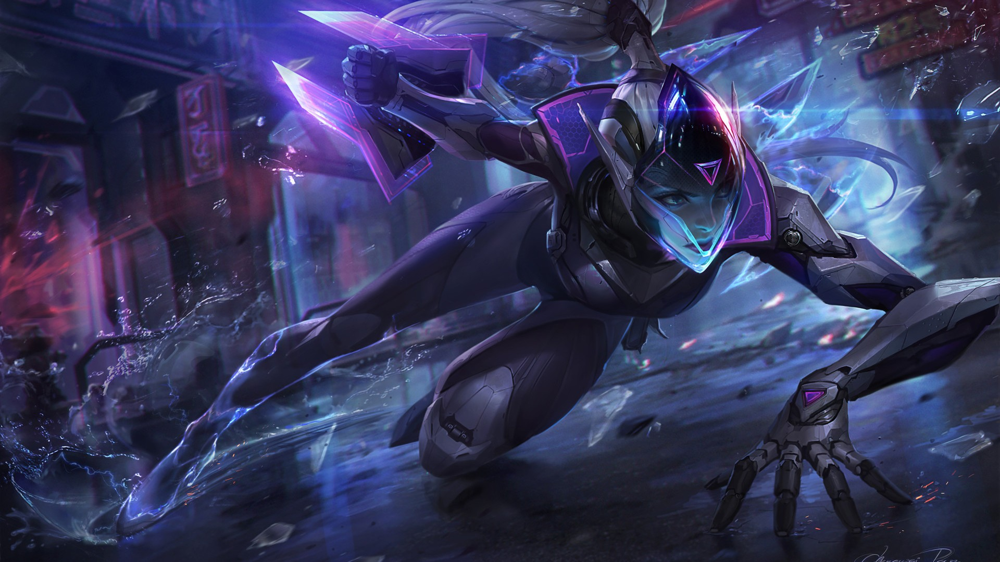

<!DOCTYPE html> 
<html lang="ko">

<html>
    <head>
        <meta charset="UTF-8">
        <meta name="viewport" content="width=device-width, initial-scale=1">
        <title>LOL 메인화면</title>
        <link href="https://cdn.jsdelivr.net/npm/bootstrap@5.3.3/dist/css/bootstrap.min.css" rel="stylesheet" integrity="sha384-QWTKZyjpPEjISv5WaRU9OFeRpok6YctnYmDr5pNlyT2bRjXh0JMhjY6hW+ALEwIH" crossorigin="anonymous">
        
        
    </head>

    <body style="background-color:black;">
        <nav class="navbar navbar-expand-lg bg-body-tertiary">
            

                <nav class="navbar bg-body-tertiary">
                    

                        
                    

                </nav>
                <a class="navbar-brand" href="#">홈페이지 테스트</a>
                <button class="navbar-toggler" type="button" data-bs-toggle="collapse" data-bs-target="#navbarNavDropdown" aria-controls="navbarNavDropdown" aria-expanded="false" aria-label="Toggle navigation">
                    
                </button>
                

                    <ul class="navbar-nav">
                        <li class="nav-item">
                            <a class="nav-link active" aria-current="page" href="#">메인페이지</a>
                        </li>
                        <li class="nav-item">
                            <a class="nav-link" href="#">기본정보</a>
                        </li>
                        <li class="nav-item">
                            <a class="nav-link" href="#">챔피언</a>
                        </li>
                        <li class="nav-item">
                            <a class="nav-link" href="#">패치 노트</a>
                        </li>
                        <li class="nav-item">
                            <a class="nav-link" href="#">새소식</a>
                        </li>
                        <li class="nav-item dropdown">
                            <a class="nav-link dropdown-toggle" href="#" role="button" data-bs-toggle="dropdown" aria-expanded="false">
                                고객지원
                            </a>
                            <ul class="dropdown-menu">
                                <li><a class="dropdown-item" href="#">게임 다운로드</a></li>
                                <li><a class="dropdown-item" href="#">롤 커뮤니티</a></li>
                                <li><a class="dropdown-item" href="#">깃 허브 페이지</a></li>
                            </ul>
                        </li>
                    </ul>
                

            

        </nav>
        <!--

            
            <h3 style="font-size: 24px; font-weight: bold; font-style: italic; color:white; font-family: '굴림';">
                <a href=" https://www.leagueoflegends.com/ko-kr/how-to-play/" target="blank">게임정보</a> 새소식 다운로드 E스포츠 이벤트 알아보기 유니버스 라이엇 스토어 고객지원
            </h3>        
        

        -->

        

        
        

        

            <table border = "1">
                <caption>인기 캐릭터</caption>
                <tbody>
                    <tr bgcolor="red">
                        <td width="80">사이온</td>
                        <td>아리</td>
                        <td>가렌</td>
                        <td>가렌2</td>
                        <td>가렌3</td>
                    </tr>
                    <tr bgcolor="gray">
                        <td colspan="5"><a href="https://www.leagueoflegends.com/ko-kr/" target="blank">롤 웹사이트 들어가기</a></td>
                    </tr>
                    <tr>
                        <td bgcolor="blue"><b>카직스</b></td>
                        <td>루시안</td>
                        <td>루시안2</td>
                        <td colspan="2">바이, 바이2</td>
                    </tr>
                </tbody>
            </table>
        
            

        

        

            <h3 style="font-size: 24px; font-weight: bold;  font-style: italic; color: white;   font-family: '굴림';">라이엇 게임 회사 정보 2024년 3월 작성됨</h3>
        

    </body>
</html>
</html>
